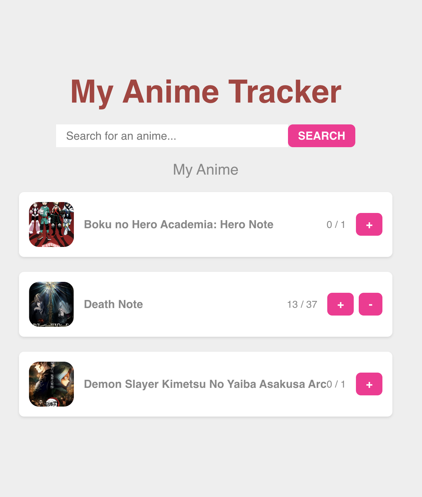
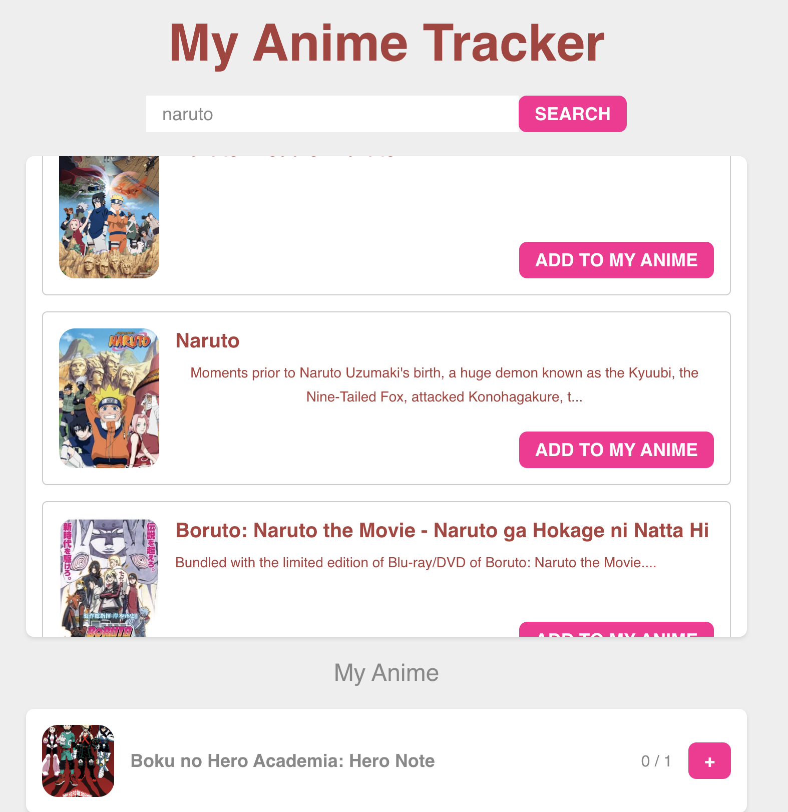

New day in #50daysofCode Challenge and a new framework - VUE - I wanted to expand on Javascript Frameworks that are commonly used.

INSPO - I watch a lot of anime and sometimes it can get hard to track all the shows I'm watching or what episode I left off on those shows. In the future I'd like to be able to host and actually use it.

Functionality

Search ANIME from database
Add Anime to list of tracked shows
Can edit which episode you are on
